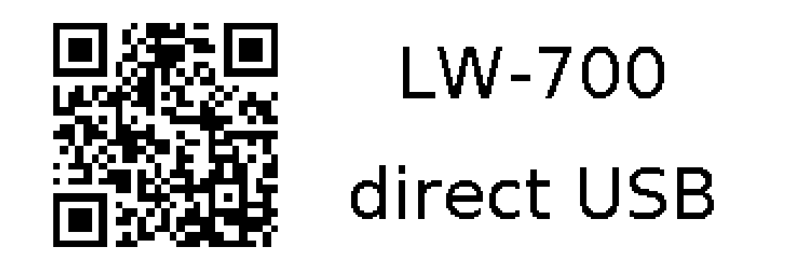

# LW700Print

Print labels on the **Epson LabelWorks LW-700** directly over USB from Python -
no Epson driver, no print spooler, no proprietary software. Ships with a small web
UI (label editor with QR / barcodes / CSV batch) and a reusable encoder library.

Built because Epson's official driver **no longer works on modern macOS**: Apple
removed third-party USB print-class plugin loading from the CUPS `usb` backend, so
the LabelWorks driver hangs at "sending data to printer" forever. This talks to the
printer's ESCPL2 language directly instead.



## How it works

The LW-700 speaks **ESCPL2** over a plain USB bulk endpoint. Printing turned out to
need no vendor handshake at all:

```
claim interface 0  ->  bulk-write the ESCPL2 stream to endpoint 0x02
```

The ESCPL2 stream and the (optional) status/cut commands were reverse-engineered
from the publicly shipped Epson filter/plugin and validated on real hardware. The
full write-up is in [docs/PROTOCOL.md](docs/PROTOCOL.md).

## Requirements

- Epson LabelWorks **LW-700** on USB, powered on, in "PC connection" mode.
- Python 3.10+, `libusb` (`brew install libusb` on macOS).
- macOS or Linux. On macOS the stock Epson driver does not need to be installed.

## Quick start

```bash
git clone https://github.com/igrbtn/LW700Print
cd LW700Print
python3 -m venv venv && ./venv/bin/pip install -r requirements.txt

# launch the web UI (opens a browser at http://127.0.0.1:8099)
./venv/bin/python app.py
```

In the editor: pick a label type (text / QR / barcode / text+QR), tape width,
1-8 lines with per-line font/size/alignment, optional CSV batch, then **Print**.
If the printer is connected it prints directly; otherwise it falls back to saving
the exact print bitmap as a PNG under `output/`.

## Use as a library

```python
from lw700 import render
from lw700.escpl2 import encode, CUT_EACH_JOB
from lw700.backends import USBBackend

spec = render.LabelSpec.from_dict({
    "tape_mm": 18, "label_type": "text_qr",
    "lines": [{"text": "Server-01"}, {"text": "192.168.0.1"}],
    "code_data": "https://example.com",
})
img = render.render(spec)                 # PIL 1-bit bitmap
USBBackend().print_label(img, tape_mm=18) # encode + bulk-write over USB
# or just get the raw bytes:
data = encode(img, cut=CUT_EACH_JOB)
```

## Command line

```bash
./lw700 status                                          # printer + auto-detected tape
./lw700 print --tape 12 --line "Server-01" --line "192.168.0.1"
./lw700 print --type cable_flag --line "R4-1 1/1/1 | HOST01" --cable-dia 6
./lw700 print --type qr --code "https://x" --line "Server-01"
./lw700 render --out label.png --line "test"            # no printer, save PNG
./lw700 batch --csv data.csv --type cable_flag --line "{marking}" --cable-dia 6
./lw700 batch --csv data.csv --template template.json   # {placeholder} substitution
```

The `batch` command substitutes `{column}` placeholders from the CSV, so an LLM or
script can fill a CSV and print a whole run. `--out` renders PNGs instead of printing.

## Tools

Small standalone probes (require the printer connected):

- `tools/probe_full.py`  - dump which control requests the printer supports.
- `tools/print_usb.py`   - render + encode + print a test label.
- `tools/engage_probe.py`- inspect the vendor status channel.

## Project layout

```
app.py             web UI launcher (FastAPI)
src/lw700/
  escpl2.py        ESCPL2 encoder (bitmap -> printer bytes)
  render.py        label -> 1-bit bitmap (text, QR, barcode, layout)
  backends.py      USB direct-print backend + PNG preview fallback
  fonts.py spec.py fonts and tape geometry
static/index.html  editor front-end
docs/PROTOCOL.md   reverse-engineered protocol reference
```

## Supported

- Tapes: 6 / 9 / 12 / 18 / 24 mm. Label types: text (1-8 lines), QR, barcode
  (Code128 / EAN / UPC / ...), text+QR. Cyrillic and other fonts via bundled DejaVu.
- Tape cut modes (each job / each page / none).

Other models in the family (LW-600P/900P/1000P) use a similar language but were not
tested here; the `O`/`W`/`t` tape-kind parameters and vendor "engage" requests differ.

## Notes & limitations

- The LW-700 auto-powers-off when idle and drops off the USB bus; turn it back on.
- The print head sits ~9 mm before the cutter, so labels get a standard ~9 mm margin
  that cannot be printed into. It is applied symmetrically on both ends (`lead` /
  `trail`, ~9 mm each) for a balanced look, with a single end-cut.
- A leading cut / tape back-feed (to shrink that margin) is **not** implemented: any
  extra or mid-job cut reliably powers this printer off, and the mechanism the stock
  driver uses is not visible in the byte stream. Single end-cut is the reliable mode.
- Tape width is auto-detected; the tool also runs without a printer (PNG preview).
- This is an independent interoperability project. It contains **no Epson code or
  binaries**. "Epson" and "LabelWorks" are trademarks of Seiko Epson Corporation;
  this project is not affiliated with or endorsed by Epson.

## License

MIT - see [LICENSE](LICENSE).
